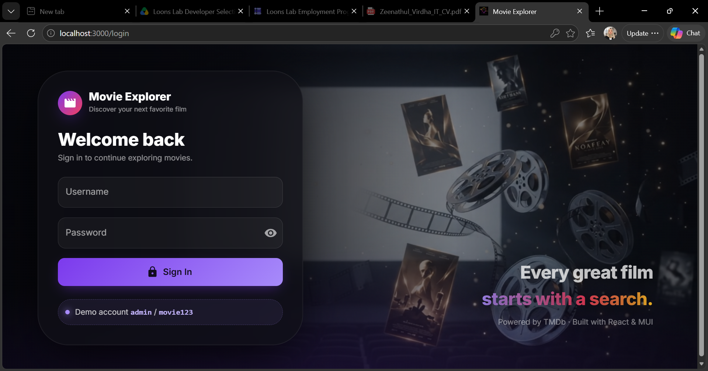
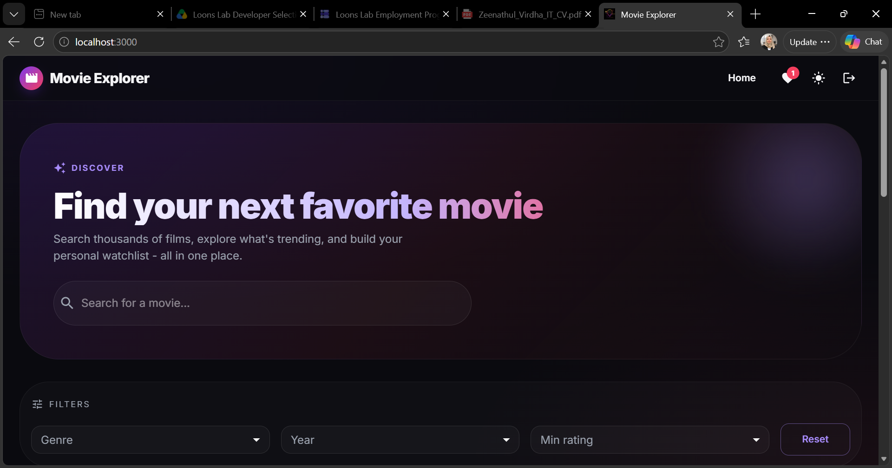
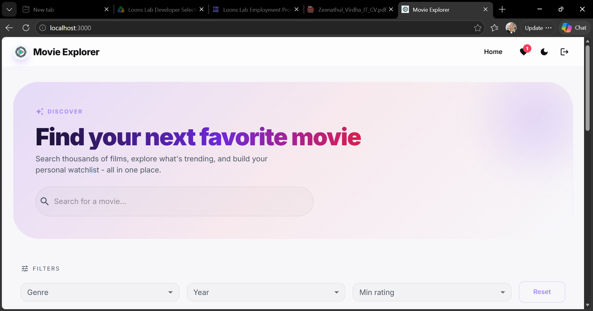
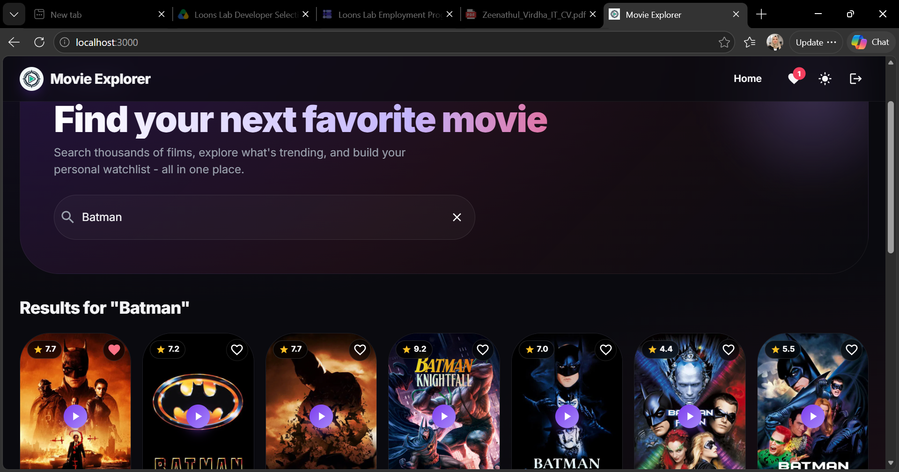
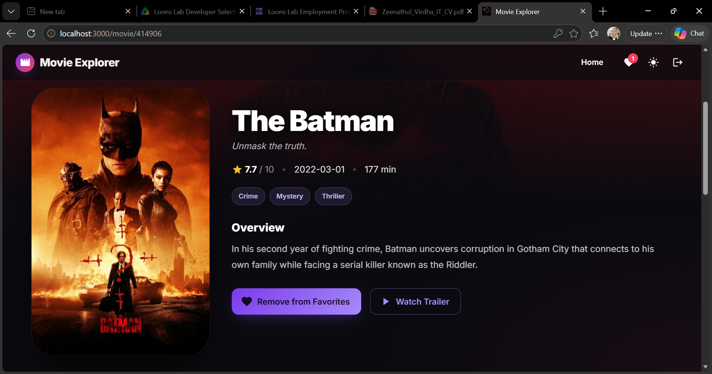
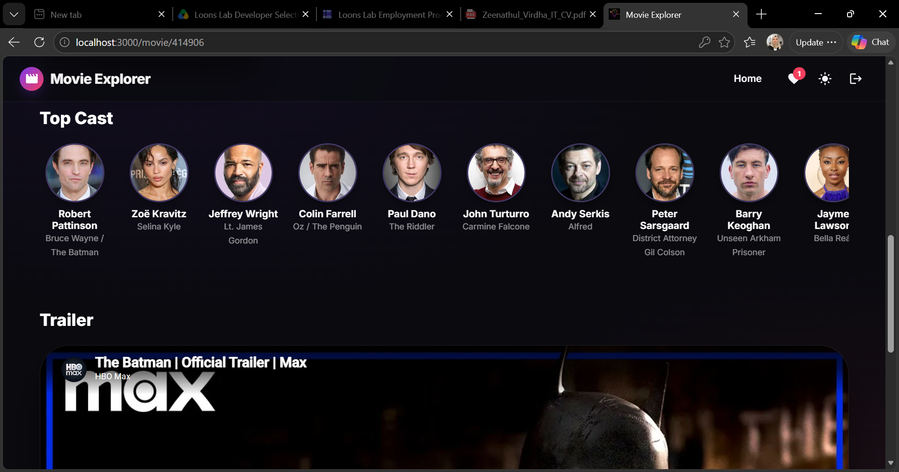
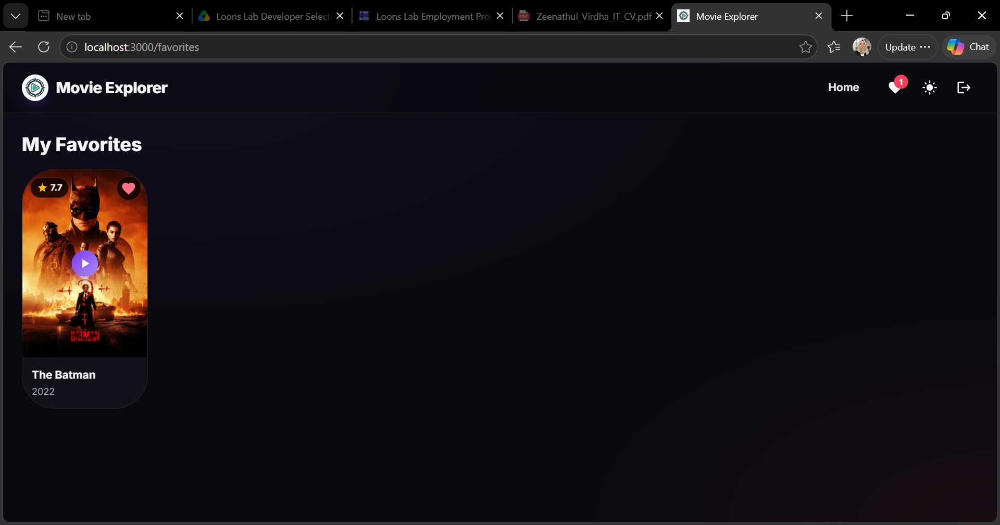
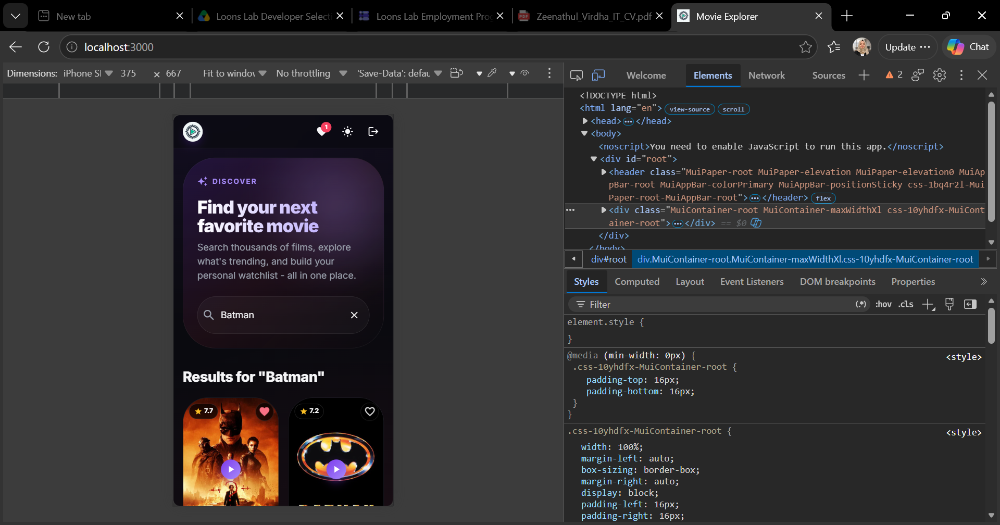

# 🎬 Movie Explorer

A responsive movie discovery web app built with React and the TMDb API. Users can search for movies, browse trending films, filter by genre/year/rating, view movie details with cast and trailers, and save favorites locally.



## 🌐 Links

- **Live demo:** https://movie-explorer-one-kohl.vercel.app
- **GitHub repository:** https://github.com/mmsvirdha/movie-explorer

**Demo login** (client-side demo, see [Notes](#-notes)):

```
Username: admin
Password: movie123
```

## ✨ Features

**Required**
- Login page with username and password
- Search bar that returns matching movies from TMDb
- Poster grid showing title, release year and rating
- Movie details page: overview, genres, runtime, cast and trailer
- Trending movies section (weekly, from TMDb)
- Light / dark mode (saved between visits)
- Infinite scrolling for search results
- Friendly error messages when an API call fails (with a Retry button)
- State managed with the React Context API
- Last search and favorite movies stored in localStorage

**Bonus**
- Filters: genre, year and minimum rating (TMDb `/discover/movie`)
- YouTube trailer embedded on the details page, plus a "Watch on YouTube" link
- "Load More" button for trending and filtered lists

**Other**
- Mobile-first responsive layout
- Loading spinners, empty states and a 404-safe redirect for unknown routes
- Protected routes: pages other than `/login` require being logged in

## 🖼️ Screenshots

| | |
|---|---|
| **Home – dark mode**  | **Home – light mode**  |
| **Search results**  | **Movie details**  |
| **Cast and trailer**  | **Favorites**  |

**Mobile view**



## 🛠️ Tech Stack

| Area | Technology |
|------|------------|
| Framework | React 18 (Create React App) |
| Routing | React Router v6 |
| State | React Context API |
| HTTP | Axios |
| UI | Material-UI (MUI) v5 |
| Data | [TMDb API v3](https://developer.themoviedb.org/) |
| Persistence | Browser localStorage |
| Deployment | Vercel |

## 🚀 Setup

**Requirements:** Node.js 18+ and a free [TMDb](https://www.themoviedb.org/signup) account.

1. Clone the repo and install dependencies:
   ```bash
   git clone YOUR_GITLAB_URL_HERE
   cd movie-explorer
   npm install
   ```
2. On TMDb go to **Settings → API** and copy your **API Read Access Token** (a long string starting with `eyJ`).
3. Create your environment file:
   ```bash
   cp .env.example .env
   ```
   (On Windows PowerShell: `copy .env.example .env`.) Then open `.env` and set:
   ```env
   REACT_APP_TMDB_TOKEN=your_read_access_token_here
   ```
4. Start the app:
   ```bash
   npm start
   ```
   Open http://localhost:3000 and log in with `admin` / `movie123`.
   Restart `npm start` whenever you change `.env`, because Create React App only reads it at startup.
5. Production build:
   ```bash
   npm run build
   ```

`.env` is listed in `.gitignore`, so your token is not committed.

## 📁 Project Structure

```
movie-explorer/
├── public/
│   ├── index.html
│   └── _redirects            # SPA fallback for Netlify
├── src/
│   ├── api.js                # Axios instance, error interceptor, image helper
│   ├── App.js                # Routes + protected route wrapper
│   ├── index.js              # Entry point (BrowserRouter + Providers)
│   ├── components/
│   │   ├── Navbar.jsx
│   │   ├── SearchBar.jsx
│   │   ├── MovieCard.jsx
│   │   └── MovieGrid.jsx
│   ├── context/
│   │   └── AppContext.jsx    # Auth, theme, movies, filters, favorites
│   └── pages/
│       ├── Login.jsx
│       ├── Home.jsx
│       ├── MovieDetails.jsx
│       └── Favorites.jsx
├── screenshots/              # Images used in this README
├── .env.example
├── .gitignore
├── vercel.json               # SPA rewrite for Vercel
├── package.json
└── README.md
```

## 🏗️ How It Works

### State management (Context API)
`AppContext.jsx` holds the shared state and exposes it through a `useApp()` hook.

| State | Details | localStorage key |
|-------|---------|------------------|
| User | Demo login session | `me_user` |
| Theme | `dark` or `light` | `me_theme` |
| Last search | Most recent search text | `me_last_search` |
| Favorites | Saved movies (id, title, poster, date, rating) | `me_favorites` |
| Movie list | Trending / search / filtered results, current page, total pages, loading and error state | not persisted |

The list has three modes: **search** (when a search text exists), **discover** (when any filter is set) and **trending** (default). Changing the search text or filters reloads page 1.

### API layer (Axios)
All requests go through one Axios instance in `src/api.js` using the TMDb Bearer token. A response interceptor converts failures into readable messages:

| Situation | Message shown |
|-----------|---------------|
| No response / offline | Network error. Check your internet connection. |
| 401 | TMDb authentication failed. Check your API token. |
| 404 | We couldn't find what you were looking for. |
| 429 | Too many requests. Please wait a moment. |
| Anything else | Something went wrong. Please try again. |

### Routing

| Route | Page | Login required |
|-------|------|----------------|
| `/login` | Login | No |
| `/` | Home (search, filters, trending) | Yes |
| `/movie/:id` | Movie details | Yes |
| `/favorites` | Favorites | Yes |

Unknown routes redirect to `/`, and logged-out users are redirected to `/login`.

### Infinite scroll
In search mode, an `IntersectionObserver` watches an empty element under the grid. When it comes into view (300px early), the next page is requested and appended to the existing results. It stops when the last page is reached (TMDb allows up to 500 pages). Trending and filtered lists use a **Load More** button instead.

## 🔌 TMDb Endpoints Used

| Purpose | Endpoint |
|---------|----------|
| Trending | `GET /trending/movie/week` |
| Search | `GET /search/movie?query=…&page=…` |
| Filters | `GET /discover/movie` (`with_genres`, `primary_release_year`, `vote_average.gte`) |
| Genre list | `GET /genre/movie/list` |
| Details, cast, videos | `GET /movie/{id}?append_to_response=credits,videos` |

Images use `https://image.tmdb.org/t/p/{size}{path}` (`w500` posters, `w185` cast photos). The trailer is the first YouTube video of type "Trailer"; if a movie has none, the trailer section is hidden.

## 🚢 Deployment (Vercel)

1. Push the project to GitLab.
2. Import the repository in Vercel (Create React App is detected automatically: build `npm run build`, output `build`).
3. Add the environment variable `REACT_APP_TMDB_TOKEN` in **Project Settings → Environment Variables**, then deploy.
4. `vercel.json` rewrites all routes to `index.html`, so refreshing a page like `/movie/155` works:
   ```json
   { "rewrites": [{ "source": "/(.*)", "destination": "/index.html" }] }
   ```

## ⚠️ Notes

- **Login is a demo.** It is checked in the browser only and is not real authentication. A production app would use a backend with hashed passwords and sessions or tokens.
- **API token exposure.** Variables starting with `REACT_APP_` are bundled into the frontend, so the TMDb token can be seen in the browser. A production app would call TMDb through a small backend proxy.
- Filters are available on the home page when no search text is entered.

## 🔮 Possible Improvements

- Backend authentication
- Automated tests (Jest and React Testing Library)
- Mobile drawer navigation and loading skeletons
- Cancelling outdated search requests with `AbortController`
- Favorites synced across devices

## 📜 Attribution

Movie data and images are provided by [The Movie Database (TMDb)](https://www.themoviedb.org/). This product uses the TMDB API but is not endorsed or certified by TMDB.

## 👤 Author

**Zeenathul Virdha Musawwir**

- Email: zeenathulvirdha.it@gmail.com
- LinkedIn: https://www.linkedin.com/in/zeenathul-virdha-musawwir-123b60329/
- GitHub: https://github.com/mmsvirdha
- Portfolio: https://virdhamusawwirportfolio.netlify.app

Built as a technical assessment for Loons Lab.